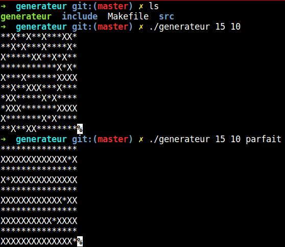
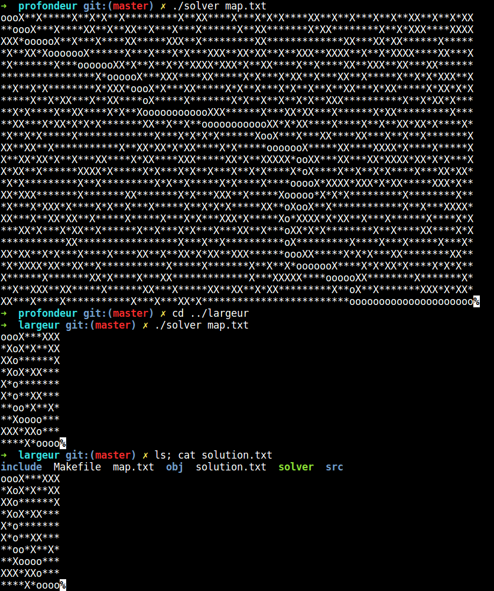

# Dante
Epitech first year project : [CPE] Dante

Second mathematic mudole project of the first year

Deadline : 5 weeks

Beginning of the project : 21/02/2016, 23h00

Group size : 1 person


# Dante

The goal of this project is to generator a maze in a file, solve it in a reasonable amount of time, and print the solution.

A tournament comparing the performances will be organized between different students who qualify for the Pitch.


## Getting started

These instructions will allow you to obtain a copy of the operational project on your local machine for development and testing purposes.

### Prerequisites

What do you need to install the software and how to install it?

```
gcc
make
```

### Installation

Here's how to start the project on your computer

Clone and go in the directory Dante

Project compilation

```
make
```

Running project

```
./generateur x y p

./profondeur [file.txt]

./largeur [file.txt]
```


## Screenshot





## Build with

* [C](https://en.wikipedia.org/wiki/C_(programming_language))

## Auteurs

* **David Munoz** - [DavidMunoz-dev](https://github.com/davidmunoz-dev)
